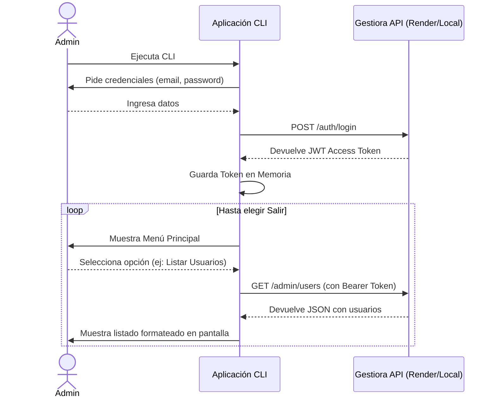

# Design Doc — DD-CLI-001 Arquitectura e Interfaz de la CLI

## 1. Contexto y Principios de Diseño
Se requiere desarrollar una Interfaz de Línea de Comandos (CLI) para que los administradores de Gestiora puedan gestionar usuarios y accesos de forma ágil. 

El objetivo de este documento es definir el diseño técnico, la arquitectura subyacente y el *stack* de herramientas que se utilizarán para construir esta herramienta, respetando el diseño funcional descrito en `borrador_idea_cli.md`.

Al igual que en el desarrollo de la Fase 1 (API/Backend), todo el código de esta nueva herramienta se regirá estrictamente bajo **buenas prácticas de ingeniería de software**, la aplicación de los principios **SOLID**, inyección de dependencias y responsabilidad única para garantizar testabilidad y bajo acoplamiento entre los módulos de *UI (vistas)* y *Servicios HTTP (API Clients)*.

## 2. Alcance Funcional e Historias de Usuario

La herramienta está dirigida exclusivamente a usuarios con rol `Administrador`. Las operativas se enmarcan en las siguientes Historias de Usuario (US) de gestión y soporte:

- **US-CLI-01 Inicio de Sesión:** Como administrador, quiero iniciar sesión de forma segura proporcionando mis credenciales (ocultando mi contraseña) para autenticar mis acciones.
- **US-CLI-02 Listado de Usuarios:** Como administrador, quiero visualizar una lista alfabética de todos los usuarios del sistema para identificar rápidamente sus correos y estados.
- **US-CLI-03 Búsqueda de Usuarios:** Como administrador, quiero buscar usuarios introduciendo una cadena de texto para encontrar rápidamente a un usuario sin navegar todo el listado.
- **US-CLI-04 Modificación de Datos:** Como administrador, quiero poder editar los campos principales del perfil de un usuario para corregir información errónea o desactualizada.
- **US-CLI-05 Deshabilitar Usuario (y Revocación):** Como administrador, quiero poder deshabilitar a un usuario, forzando la revocación automática de sus sesiones, para cortar el acceso de manera inmediata frente a brechas de seguridad.
- **US-CLI-06 Restablecer Contraseña:** Como administrador, quiero establecer una nueva contraseña a un usuario (confirmándola dos veces) y que se le revoquen las sesiones actuales, forzándole a reloguearse con la nueva credencial.

*Las validaciones formales, como evitar que un administrador inhabilite sus propias sesiones al cambiar su propia contraseña, deben respetarse tal y como define el Backend en su núcleo.*

## 3. Estudio de Alternativas de Implementación

Antes de decidir la arquitectura de la CLI, se plantearon y evaluaron tres posibles estrategias abordables en cuanto a su grado de acoplamiento y lugar de ejecución:

### Estrategia A: CLI Integrada en el Proyecto como Entrypoint (Uso Directo de BD)
Consistía en añadir un archivo `src/cli.ts` junto al backend, instanciando el *Composition Root* y llamando directamente a los Casos de Uso saltándose Fastify y HTTP.
*   **Pros:** Reaprovechamiento absoluto del dominio. Sin sobrecarga de red; operaciones instantáneas. No requería gestionar tokens JWT en la CLI.
*   **Contras:** Obligaba al administrador a conectarse por SSH al servidor de producción (Render) cada vez que deseara administrar usuarios. Contaminaría el `package.json` de la API con librerías ajenas e interactivas. Se descartó por problemas logísticos en infraestructuras efímeras o en la nube.

### Estrategia B: Monorepo Workspaces (`core`, `api`, `cli`)
Transformar todo el ecosistema Gestiora a npm workspaces o turborepo extrayendo la lógica a un `packages/core` compartido entre `apps/api` y `apps/cli`.
*   **Pros:** Arquitectura definitiva. Permite compartir el *core* en local para que la CLI opere nativamente pero con un acoplamiento modular perfecto.
*   **Contras:** Requeriría una refactorización severa antes de lanzar la Fase 2, rompiendo los test actuales, las rutas de CI/CD y los despliegues en GitHub y Render. Considerado "sobre-ingeniería" para la madurez actual.

### Estrategia C: Proyecto Independiente Cliente HTTP (Estrategia Elegida)
Desarrollar la CLI desligada de los casos de uso, actuando puramente como si de un Frontend se tratase ("Mecanismo de Entrega").
*   **Pros:** Ejecutable local por el administrador consumiendo a los servidores de producción; hereda y valida todas las capas de Rate-Limiting, IAM y trazabilidad HTTP.
*   **Contras:** Exige programar lógica de mantenimiento de sesión temporal (almacenamiento del estado asíncrono para el ciclo del JWT).

## 4. Decisión Arquitectónica: Cliente HTTP Independiente alojado en el Repositorio (Estrategia C)

Tras el estudio previo, se ha optado por implementar la **Estrategia C**. Sin embargo, para no complicar el gobierno y versionado del código, en lugar de alojarla en un repositorio de GitHub aislado, se alojará como un módulo dependiente **dentro del mismo repositorio** (`/cli`).

### Ventajas de esta arquitectura:
- El administrador puede operar desde su máquina local atacando directamente a los endpoints de producción o desarrollo.
- Se aprovecha integralmente toda la lógica de negocio y las capas de seguridad (Rate Limiting, Hasheo, Login Attempts) ya construidas en el backend HTTP.
- Facilita el mantenimiento sincronizado en el mismo repositorio, permitiendo validar cambios de contratos API frente a la CLI en la misma Pull Request.

## 5. Stack Tecnológico de la Interfaz Interactiva

El diseño funcional requiere que la operativa sea un **proceso interactivo tipo "wizard" (REPL)** a base de menús que guíen al administrador paso a paso, sin la necesidad de pasar argumentos ni aprender comandos complejos de terminal.

*   **Lenguaje:** TypeScript (strict mode) en total sintonía con el estilo y configuración (`tsconfig`) del proyecto backend.
*   **Punto de entrada:** Un script autoejecutable simple (`index.ts`) que servirá como punto de arranque directo. *Nota: Se ha descartado el uso de librerías de parsing de comandos como `Commander`, ya que el enfoque será 100% basado en menús internos y no requiere recibir opciones mediante CLI flags.*
*   **Ciclo de Menús (`@inquirer/prompts`):** Será el motor de la interfaz. Proveerá selecciones en lista de la que el administrador puede escoger usando su teclado, así como una entrada rápida y segura de contraseñas u ocultar inputs (`***`).
*   **Peticiones HTTP (`fetch` nativo):** Al implementarse en un entorno `Node 24+` (conforme al entorno de proyecto), se utilizará la API `Fetch` nativa debidamente tipada mediante las interfaces del dominio para comunicarse con la API.

## 6. Gestión de Estado y Ciclo de Vida (JWT)
El CLI funcionará siendo totalmente *stateless* (sin persistencia en disco por parte del cliente). El almacenamiento de variables clave (credenciales) ocurrirá exclusivamente en variables limitadas al ciclo de vida del *loop* principal del menú.

### Diagrama de Secuencia 



## 7. Estructura de Proyecto Propuesta
El código residirá bajo un directorio raíz nuevo `/cli`, estrictamente separado del backend `src/`. Adoptando una arquitectura estándar de tres capas más dominio, totalmente orientada a principios SOLID:

```text
/cli
├── package.json          # Dependencias (@inquirer/prompts, typescript, etc.)
├── tsconfig.json
└── src
    ├── index.ts          # Inicializador y bucle "REPL" infinito (Composition Root parcial)
    ├── core/             # Estado de sesión (Manejador del JWT en memoria) y utilidades
    ├── domain/           # Entidades, Types y Custom Errors (User, AuthResponse, etc.)
    ├── application/      # Casos de Uso / Servicios (Lógica del frontend CLI)
    └── infrastructure/   # Implementaciones externas
        ├── api/          # Peticiones HTTP reales (Wrappers de fetch contra Gestiora API)
        └── ui/           # Dibujado de vistas y menús de `@inquirer/prompts`
```

## 8. Entorno de Pruebas y TDD
Dada la naturaleza desacoplada y los estándares exigidos por el proyecto (`RULES.md`, `AGENTS.md`), el desarrollo de la CLI se realizará bajo la metodología **TDD (Test-Driven Development)**:
*   **Herramienta:** Se utilizará `vitest`, compartiendo así en la medida de lo posible la configuración o los ecosistemas que ya se usan en el backend principal.
*   **Alcance del Testing:** Se probará exhaustivamente cada regla de negocio y transformación de datos, asegurando la robustez del CLI sin tener que hacer interacciones físicas constantes en la terminal. El esfuerzo del testeo recaerá fuertemente sobre las capas aisladas de `application/` y `domain/`, mockeando (`vi.mock()`) las salidas por consola de `@inquirer/prompts` y las respuestas HTTP nativas producidas en `infrastructure/`.

---

## 9. Empaquetado y Configuración de Entorno

### Entregable y Ejecución
La aplicación será desarrollada utilizando **TypeScript (strict)** en sintonía con las políticas del backend. No se empaquetará como binario compilado único (*pkg*). Durante el ciclo de desarrollo se ejecutará directamente mediante `npx tsx` y, para el entregable, se compilará con `tsc` a código Vanilla JS. El único requisito del administrador será contar con un runtime Node.js instalado en el sistema operativo cliente.

### Inyección de Entorno
La CLI debe poder apuntar al backend local o de producción. Para la correcta separación de entornos, se leerá una variable de entorno `API_BASE_URL`. En caso de no existir o ser llamada sin ella en local, operará mediante *fallback* o leyendo un archivo `.env` configurado.

## 10. Mapeo de Arquitectura Guiada por Clean Architecture
Aunque sea un cliente de CLI, adoptará un patrón de diseño estricto basado en Clean Architecture, separando el código en 3 capas fundamentales + Dominio de la siguiente manera:

1. **Domain (`src/domain/`):** El centro de todo. Contiene exclusivamente tipos, interfaces e insignias (ej: `User`, `UserRole`, `AuthResponse`, y posibles errores custom). Absolutamente agnóstico e independiente de cualquier otra capa del CLI o del Backend. 
2. **Application (`src/application/`):** Contiene los casos de uso (`Use Cases` / `Services`) que orquestan las acciones del usuario. Actúa de pegamento: decide qué llamar de la infraestructura y cómo formatear lo que se le enviará a la capa de UI. No sabe que existe `Fetch` ni sabe que existe `@inquirer/prompts`.
3. **Infrastructure (`src/infrastructure/`):** Todo lo que interactúa con el mundo exterior hacia "afuera" o "hacia el usuario":
   - **`api/`:** Adaptadores HTTP puros que implementan interfaces definidas en Application, usando nativamente `fetch` para comunicarse con la API de Gestiora. Inyecta el Bearer Token automáticamente.
   - **`ui/` (Views/Prompts):** Controla el dibujado de la consola y la entrada interactiva (`@inquirer/prompts`). Instancia (o recibe) los Casos de Uso y les pasa los parámetros introducidos por el teclado del administrador.
4. **Core (`src/core/`):** Mantiene el estado persistido *in-memory* durante la vida de la app (como el `JWT Access Token`).
   *Nota: Dado que se aprovechará el entorno Node nativo, la lectura de variables de entorno (como `API_BASE_URL`) se hará directamente procesando el `.env` u obteniéndolo de `process.env`, lo que elimina la necesidad de un módulo o carpeta `config/` dedicada inicial.*